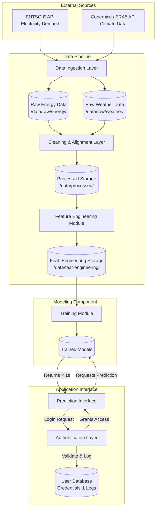

# Architecture: Climate-Driven Energy Demand Analytics System | V1.3

This document outlines the high-level system architecture, data flow, security boundaries, and quality attributes of the Climate-Driven Energy Demand Analytics System project.

## 1. System Diagram

The following diagram illustrates the modular components of the system and their interactions.

## 2. Architectural Design Patterns

The system is designed around two primary architectural patterns to ensure modularity and separation of concerns:

**Pipe-filter Architecture:** The machine learning backend relies on a linear data flow pipeline. Data moves sequentially from ingestion, to cleaning, to feature engineering, and finally to modeling. This ensures reproducibility and strict separation between raw and processed data states.

**Client-Server Architecture:** The application interface relies on a client-server approach where a frontend UI communicates with a backend REST API. An Authentication Layer sits between the client requests and the core application logic, acting as a strict gateway.

## 3. Data Flow

The data pipeline is designed to be fully reproducible and executable via code, avoiding any manual steps. The workflow consists of the following stages:

* **Data Ingestion:** The system pulls electricity load data from the ENTSO-E Transparency Platform and meteorological variables from the Copernicus Climate Data Store .

* **Raw Storage:** This ingested data is saved directly, without manual modification, into `/data/raw/energy/` and `/data/raw/weather/`.

* **Cleaning and Alignment:** The cleaning module reads the raw files, resolves inconsistencies, removes corrupted records, handles missing values and outliers and aligns both datasets to a common hourly temporal resolution.

* **Processed Storage:** The cleaned, aligned dataset is saved securely into `/data/processed/`.

* **Feature Engineering:** The module reads the processed data and generates predictive features, including temporal indicators (hour, day, season), rolling climate averages, and others, and lagged demand features.

* **Processed Feature Engineering:** The different cases of feature engineering datasets are saved securely into `/data/feat-engineering/`.

* **Modeling and Prediction:** The engineered features are fed into the modeling component to train models using a time-aware split. The trained models are then queried by the client to generate predictions.

## 4. Authentication Layer

The Authentication Layer acts as a strict gateway. It mediates all access to prediction generation, model training, and evaluation results, considering user/admin role.

* **Credential Management:** Users must register with a username, an email and a password. Passwords enforce a minimum length of 8 characters and a maximum of 20 characters.

* **Security:** Passwords are never stored in plaintext. They are hashed securely using the bcrypt cryptographic hash function before storage.

* **Role-Based Access Control:** The system distinguishes between standard Users and Admins. Standard users are granted access to execute models and view predictions. Admins are granted full system access, including triggering the training of new models.

* **Session Mediation:** When a user attempts to access protected functionalities, the authentication layer uses a bearer token alreay given to the user in authentication to access the permitted functionalities.

* **Logging:** All authentication attempts (successful and failed) are systematically logged, recording the timestamp and the user's email/username.

## 5. Quality Attributes Implementation

The system explicitly addresses performance, reliability, and security to ensure a robust engineering standard.

### 5.1. Performance

* **Execution Tracking:** Execution time for key components (ingestion, feature engineering, training) is systematically measured and logged.

* **Prediction Latency:** The prediction interface and underlying models are optimized to respond to prediction requests within 1 seconds in a local execution environment.

### 5.2. Reliability

* **Graceful Degradation:** The system handles failures gracefully; incomplete or partially missing inputs during cleaning do not cause unexpected crashes.

* **Safe Ingestion:** Network failures during API calls (ingestion) result in a clean termination rather than hanging the system.

* **Secure Error Handling:** Invalid login attempts are caught via input validation and handled cleanly, strictly avoiding the exposure of stack traces or internal implementation details. Unit tests include these failure scenarios to verify robustness.

### 5.3. Security

* **No Hardcoded Secrets:** Credentials, API keys, and database URIs are never hardcoded in the repository.

* **Environment Variables:** Configuration relies on environment variables, and local .env files are strictly excluded from version control via .gitignore.

* **Input Validation:** Basic input validation is implemented across both the authentication layer and the prediction interface to prevent trivial misuse.

### 5.4. Usability

* **Efficiency**: The user interface is designed for rapid navigation. Any primary functionality—whether it is requesting a prediction, viewing evaluation metrics, or triggering model training—can be accessed within three clicks from the main dashboard.

* **Familiarity & Design**: The interface relies on standard, familiar design patterns (clear navigation bars, readable typography) to ensure a minimal learning curve for new users.

### 5.5. Maintainability

* **Automated Testing:** The codebase is heavily supported by automated testing, encompassing both unit tests for individual functions and integration tests.

* **Continuous Integration:** A GitLab CI pipeline is configured to automatically install dependencies and run the full test suite on every code push, ensuring that new additions do not break existing functionality.

* **Version Control:** All development utilizes Git with a structured branching strategy and merge requests to maintain a clean and readable commit history.

### 5.6. Functionality

* **End-to-End Completeness:** Any new functionality introduced to the system — whether it is a new data transformation step, a predictive model, or an endpoint — must be fully operational and successfully fulfill its intended purpose before being merged into the main branch.