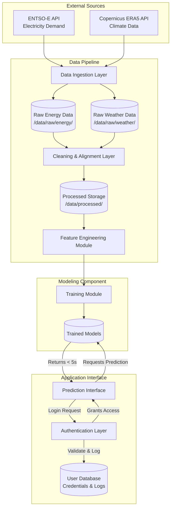

# Architecture: Climate-Driven Energy Demand Analytics System | V1.1

This document outlines the high-level system architecture, data flow, security boundaries, and quality attributes of the Climate-Responsive Energy Systems project.

## 1. System Diagram

The following diagram illustrates the modular components of the system and their interactions.

## 2. Data Flow

The data pipeline is designed to be fully reproducible and executable via code. The workflow consists of the following stages:

* **Data Ingestion (Corrections ????):** The system pulls hourly electricity load data from the ENTSO-E Transparency Platform and meteorological variables (temperature, solar radiation, wind speed) from the Copernicus Climate Data Store .

* **Raw Storage (Corrections ????):** This ingested data is saved directly, without manual modification, into `/data/raw/energy/` and `/data/raw/weather/`.

* **Cleaning and Alignment:** The cleaning module reads the raw files, resolves time zone inconsistencies, handles missing timestamps, removes corrupted records, and aligns both datasets to a common hourly temporal resolution.

* **Processed Storage:** The cleaned, aligned dataset is saved securely into `/data/processed/`.

* **Feature Engineering (Corrections ????):** The module reads the processed data and generates predictive features, including temporal indicators (hour, day, season), rolling climate averages, and lagged demand features.

* **Modeling and Prediction:** The engineered features are fed into the modeling component to train a linear regression baseline and a random forest model using a time-aware train/test split. The trained models are then queried by the UI to generate predictions.

## 3. Authentication Layer

The Authentication Layer acts as a strict gateway. It mediates all access to prediction generation, **(Corrections ????)** model training, and evaluation results.

* **Credential Management:** Users must register with a username and a password (minimum 8 characters, maximum 20 characters).

* **Security:** Passwords are hashed securely using encryption before storage.

* **Session Mediation:** When a user attempts to access the frontend prediction interface, the authentication layer prompts for credentials, hashes the input, and compares it against the stored hash.

## 4. Discussion of Quality Attributes Implementation

The system explicitly addresses performance, reliability, and security to ensure a robust engineering standard.

### 4.1. Performance

* **Execution Tracking:** Execution time for key components (ingestion, feature engineering, training) is systematically measured and logged.

* **Prediction Latency:** The prediction interface and underlying models are optimized to respond to prediction requests within 1 second in a local execution environment.

### 4.2. Reliability

* **Graceful Degradation:** The system handles failures gracefully; incomplete or partially missing inputs during cleaning do not cause unexpected crashes.

* **Safe Ingestion:** Network failures during API calls (ingestion) result in a clean termination rather than hanging the system.

* **Secure Error Handling:** Invalid login attempts are caught via input validation and handled cleanly, strictly avoiding the exposure of stack traces or internal implementation details. Unit tests include these failure scenarios to verify robustness.

### 4.3. Security

* **No Hardcoded Secrets:** Credentials, API keys, and database URIs are never hardcoded in the repository.

* **Environment Variables:** Configuration relies on environment variables, and local .env files are strictly excluded from version control via .gitignore.

* **Input Validation:** Basic input validation is implemented across both the authentication layer and the prediction interface to prevent trivial misuse.