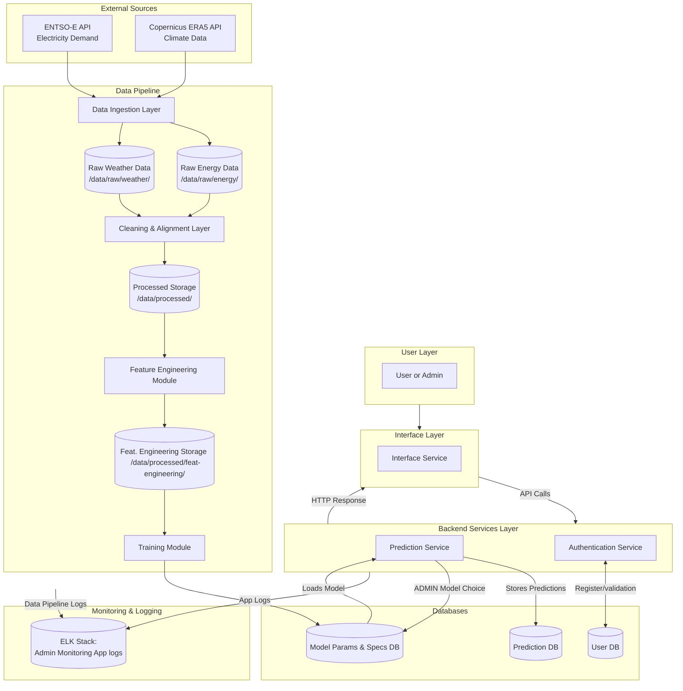

# Architecture: Climate-Driven Energy Demand Analytics System | V1.6

This document outlines the high-level system architecture, data flow, security boundaries, and quality attributes of the Climate-Driven Energy Demand Analytics System project.

## 1. System Diagram

The following diagram illustrates the modular components of the system and their interactions.

## 2. Architectural Design Patterns

The system is designed around two primary architectural patterns to ensure modularity and separation of concerns:

**Pipe-filter Architecture:** The machine learning backend relies on a linear data flow pipeline. Data moves sequentially from ingestion, to cleaning, to feature engineering, and finally to modeling. This ensures reproducibility and strict separation between raw and processed data states.

**Layer Architecture:** The live application is sliced into four isolated tiers: User, Interface, Backend Services, and Databases. A layer can only talk to the one right next to it. For example, the Interface cannot bypass the Backend to grab data directly from the Database. This forces all traffic to go through the Authentication Service , keeping the system secure.

**Client-Server Architecture:** The frontend UI communicates with the backend server using standard API calls. The client asks for something - like a prediction - and the server does the heavy lifting. Then the server sends the results back via an HTTP response. For each request, the user is logged through a bearer token.

## 3. Data Flow

The data pipeline is designed to be fully reproducible and executable via code, avoiding any manual steps. The workflow consists of the following stages:

### 3.1 Data Ingestion
The system pulls electricity load data from the ENTSO-E Transparency Platform and meteorological variables from the Copernicus Climate Data Store.

* **Raw Storage:** This ingested data is saved directly, without manual modification, into `/data/raw/energy/` and `/data/raw/weather/`.

### 3.2 Cleaning and Alignment
The cleaning module reads the raw files, resolves inconsistencies, removes corrupted records, handles missing values and outliers and aligns both datasets to a common hourly temporal resolution.

* **Processed Storage:** The cleaned, aligned dataset is saved securely into `/data/processed/`.

### 3.3 Feature Engineering
The module reads the processed data and generates predictive features, including temporal indicators (hour, day, season), rolling climate averages, and others, and lagged demand features.

* **Processed Feature Engineering:** The different cases of feature engineering datasets are saved securely into `/data/processed/feat-engineering/`.

### 3.4 Modeling and Prediction
The engineered features are fed into the modeling component to train models using a time-aware split. The trained models are then queried by the client to generate predictions.

## 4. Application Layers & Core Services
While the Data Pipeline handles the offline training and processing, the live application operates on a decoupled 4-tier architecture (User, Interface, Backend, and Databases). This ensures that heavy data science workloads do not interfere with real-time user requests. The core backend functionalities are driven by the following services:

### 4.1. Prediction Service
The Prediction Service is the engine that serves live user requests by utilizing the trained machine learning models.

The service supports two distinct temporal resolutions, each driven by their respective model formulations:

* **Hourly Model Prediction:** Designed for high-granularity forecasting, predicting the energy load for each specific hour of a given day. This is critical for identifying daily peak loads and sudden demand ramps caused by rapid weather changes.

* **Daily Model Prediction:** Designed for aggregated trend analysis, predicting the total or average energy demand for an entire day. This model leverages smoothed, daily-averaged meteorological data and is useful for broader operational planning.

When a user requests a prediction, the service dynamically queries the model database to load the current "active" (production) model for the requested resolution, ensures the input features are formatted correctly, and returns the inferred energy demand.

### 4.2. Authentication Service

The Authentication Layer acts as a strict gateway. It mediates all access to prediction generation, model training, and evaluation results, considering user/admin role.

* **Credential Management:** Users must register with a username, an email and a password. Passwords enforce a minimum length of 8 characters and a maximum of 20 characters.

* **Security:** Passwords are never stored in plaintext. They are hashed securely using the bcrypt cryptographic hash function before storage.

* **Role-Based Access Control:** The system distinguishes between standard Users and Admins. Standard users are granted access to execute models and view predictions. Admins are granted full system access, including triggering the training of new models.

* **Session Mediation:** When a user attempts to access protected functionalities, the authentication layer uses a bearer token already given to the user in authentication to access the permitted functionalities.

* **Logging:** All authentication attempts (successful and failed) are systematically logged, recording the timestamp and the user's email/username.

### 4.3. Live Data Scheduler (Real-Time Ingestion)
Because the predictive models rely heavily on lagged variables and rolling temporal features, the system cannot rely solely on static historical data.

To bridge this gap without triggering a full pipeline retraining, the system employs a Live Data Scheduler.

* **Background Synchronization:** This background service periodically triggers data ingestion cycles.

* **Recent Window Fetching:** It queries the ENTSO-E and Copernicus APIs strictly for the recent historical window that is absent from the static processed storage.

* **On-the-fly Cleaning and Feature Generation:** It cleans and processes this immediate temporal window so the Prediction Service has the exact historical lags and rolling averages required to compute today's or tomorrow's prediction accurately.

### 4.4. Administrator Capabilities & Model Management
The system provides a robust administrative layer designed for system maintainers and data scientists to manage the application lifecycle without altering the codebase.

* **Production Model Promotion:** As the Data Pipeline runs and generates newly trained models, these models are saved to the model database in a dormant state. Admins can view the evaluation metrics (MAE, RMSE, R2) of all available models and dynamically select which model should be marked as `is_active=True`. The Prediction Service immediately begins routing live traffic to this newly promoted model without requiring a server restart.

* **System Observability:** Admins are granted elevated access to view system health, usage metrics, and live dashboards, heavily relying on the integrated logging infrastructure using ELK Kibana dashboard.

## 5. Centralized Logging & Monitoring (ELK Stack)
To ensure high observability, security auditing, and debugging capabilities, the architecture integrates the ELK Stack (Elasticsearch, Logstash, Kibana) as its centralized logging layer.

Rather than having isolated log files scattered across different containers, all components stream their telemetry to a single source of truth:

* **Data Pipeline Logs:** Execution times, external API timeouts, missing data warnings during cleaning, and training metrics are pushed to ELK. This allows data scientists to track pipeline health.

* **Backend & Authentication Logs:** The FastAPI server logs all incoming API requests, HTTP response times, user login events (both successful and failed), and authorization token validations.

* **Prediction Logs:** Metadata about prediction requests (who asked, when, which model was used, and the system latency) is continuously recorded.

* **Kibana Dashboards:** The Admin layer utilizes Kibana to visualize these aggregated logs. Admins can monitor traffic spikes, investigate user access patterns, trace the exact point of failure if an external API (like ENTSO-E) goes down, and ensure the prediction latency remains within the defined quality attributes.

## 6. Quality Attributes Implementation

The system explicitly addresses performance, reliability, and security and others to ensure a robust engineering standard. Below we consider some of the QAs of this system. Check [Quality Attributes Definition](../Requirements/QUALITY_ATTRIBUTES.md) to get the applied QAs.

### 6.1. Performance

* **Execution Tracking:** Execution time for key components (ingestion, feature engineering, training) is systematically measured and logged.

* **Prediction Latency:** The prediction interface and underlying models are optimized to respond to prediction requests within 1 seconds in a local execution environment.

### 6.2. Reliability

* **Graceful Degradation:** The system handles failures gracefully; incomplete or partially missing inputs during cleaning do not cause unexpected crashes.

* **Safe Ingestion:** Network failures during API calls (ingestion) result in a clean termination rather than hanging the system.

* **Secure Error Handling:** Invalid login attempts are caught via input validation and handled cleanly, strictly avoiding the exposure of stack traces or internal implementation details. Unit tests include these failure scenarios to verify robustness.

### 6.3. Security

* **No Hardcoded Secrets:** Credentials, API keys, and database URIs are never hardcoded in the repository.

* **Environment Variables:** Configuration relies on environment variables, and local .env files are strictly excluded from version control via .gitignore.

* **Input Validation:** Basic input validation is implemented across both the authentication layer and the prediction interface to prevent trivial misuse.

### 6.4. Usability

* **Efficiency**: The user interface is designed for rapid navigation. Any primary functionality—whether it is requesting a prediction, viewing evaluation metrics, or triggering model training—can be accessed within three clicks from the main dashboard.

* **Familiarity & Design**: The interface relies on standard, familiar design patterns (clear navigation bars, readable typography) to ensure a minimal learning curve for new users.

### 6.5. Maintainability

* **Automated Testing:** The codebase is heavily supported by automated testing, encompassing both unit tests for individual functions and integration tests.

* **Continuous Integration:** A GitLab CI pipeline is configured to automatically install dependencies and run the full test suite on every code push, ensuring that new additions do not break existing functionality.

* **Version Control:** All development utilizes Git with a structured branching strategy and merge requests to maintain a clean and readable commit history.