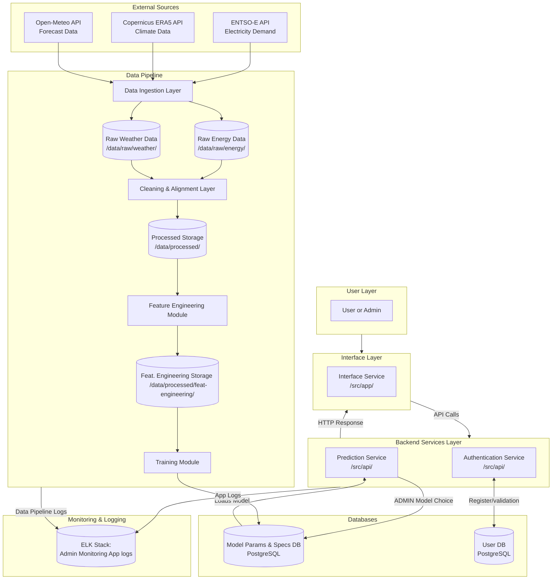

# Architecture: Climate-Driven Energy Demand Analytics System | V1.7

This document outlines the high-level system architecture, data flow, security boundaries, and quality attributes of the Climate-Driven Energy Demand Analytics System project.

## 1. System Diagram

The following diagram illustrates the modular components of the system and their interactions.

## 2. Architectural Design Patterns

The system is designed around two primary architectural patterns to ensure modularity and separation of concerns:

**Pipe-filter Architecture:** The machine learning backend relies on a linear data flow pipeline. Data moves sequentially from ingestion, to cleaning, to feature engineering, and finally to modeling. This ensures reproducibility and strict separation between raw and processed data states.

**Layer Architecture:** The live application is sliced into four isolated tiers: User, Interface, Backend Services, and Databases. A layer can only talk to the one right next to it. For example, the Interface cannot bypass the Backend to grab data directly from the Database. This forces all traffic to go through the Authentication Service , keeping the system secure.

**Client-Server Architecture:** The frontend UI (PyQt6) communicates with the backend server (FastAPI) using standard API calls. The client asks for something - like a prediction - and the server does the heavy lifting. Then the server sends the results back via an HTTP response. For each request, the user is logged through a bearer token.

## 3. Data Flow

The data pipeline is designed to be fully reproducible and executable via code, avoiding any manual steps. The workflow consists of the following stages:

### 3.1 Data Ingestion
The system pulls electricity load data from the ENTSO-E Transparency Platform and meteorological variables from the Copernicus Climate Data Store.
* **Raw Storage:** This ingested data is saved directly, without manual modification, into `/data/raw/energy/` and `/data/raw/weather/`.

### 3.2 Cleaning and Alignment
The cleaning module reads the raw files, resolves inconsistencies, removes corrupted records, handles missing values and outliers and aligns both datasets to a common hourly temporal resolution.
* **Processed Storage:** The cleaned, aligned dataset is saved securely into `/data/processed/`.

### 3.3 Feature Engineering
The module reads the processed data and generates predictive features, including temporal indicators (hour, day, season), rolling climate averages (mean, std, RMS), and lagged demand features.
* **Feat. Engineering Storage:** The different feature sets (full, selected, pca) are saved securely into `/data/processed/feat-engineering/`.

### 3.4 Modeling and Prediction
The engineered features are fed into the modeling component to train models using a time-aware split. The trained models (Random Forest and Linear Regression) are then queried by the client to generate predictions.

## 4. Application Layers & Core Services
While the Data Pipeline handles the offline training and processing, the live application operates on a decoupled 4-tier architecture (User, Interface, Backend, and Databases).

### 4.1. Prediction Service (`/src/api/`)
The engine that serves live user requests by utilizing the trained machine learning models.
* **Hourly Model Prediction:** High-granularity forecasting for peak load identification.
* **Daily Model Prediction:** Aggregated trend analysis for broader operational planning.

### 4.2. Authentication Service (`/src/api/`)
Acts as a strict gateway using JWT Bearer tokens and role-based access control (RBAC).
* **Credential Management:** Secure Bcrypt hashing for passwords.
* **Role-Based Access Control:** Distinguishes between standard Users (Predictions/Simulations) and Admins (Training/Model Promotion).

### 4.3. Live Data Scheduler (`/src/data_pipeline/`)
Bridges the gap between static historical data and real-time prediction requirements.
* **35-Day Window Fetching:** Periodically queries APIs for exactly 35 days of recent history. This specific window is mandatory to satisfy the mathematical requirements of rolling 30-day averages and 28-day lags without zero-filling (NaN).
* **On-the-fly Processing:** Processes this immediate window to provide valid features for the Inference Engine.

### 4.4. Administrator Capabilities & Model Management (`/src/api/`)
* **Production Model Promotion:** Admins evaluate RMSE/MAE/R2 metrics and toggle which model is "active." The Prediction Service hot-reloads the active binary without downtime.
* **System Observability:** Elevated access to Kibana dashboards for traffic and health monitoring.

## 5. Centralized Logging & Monitoring (ELK Stack)
All components stream telemetry to a centralized Elasticsearch instance:
* **Pipeline Logs:** Ingestion health, cleaning warnings, and training metrics.
* **Application Logs:** Request/response cycles, authentication events, and latency tracking.
* **Audit Trail:** Comprehensive logging of model activations and security events.

## 6. Scalability & Vision
The architecture is designed to scale beyond its current national scope (Spain):
*   **Regional Scaling:** The data structures support transitioning from national-level to regional or city-specific demand centers by adjusting geographical bounding boxes in the Ingestion Layer.
*   **European Expansion:** Leveraging standardized international APIs (ENTSO-E, Copernicus) allows the same Pipe-Filter logic to be applied to other European nations with minimal configuration changes.

## 7. Quality Attributes Implementation
Check [Quality Attributes Definition](../Requirements/QUALITY_ATTRIBUTES.md) for full response measures.

* **Performance:** Prediction latency < 1.0s; 100% execution tracking in ELK.
* **Reliability:** 35-day buffer for feature parity; auto-recovery from backend crashes via Docker restart policies.
* **Security:** 0 hardcoded secrets (Environment Variables); standard JWT authentication; 4-attempt lockout protection.
* **Maintainability:** >70% automated test coverage; strict branch protection and CI verification.
* **Usability:** 3-click navigation rule; <100ms tooltip latency for interactive visualizations.
