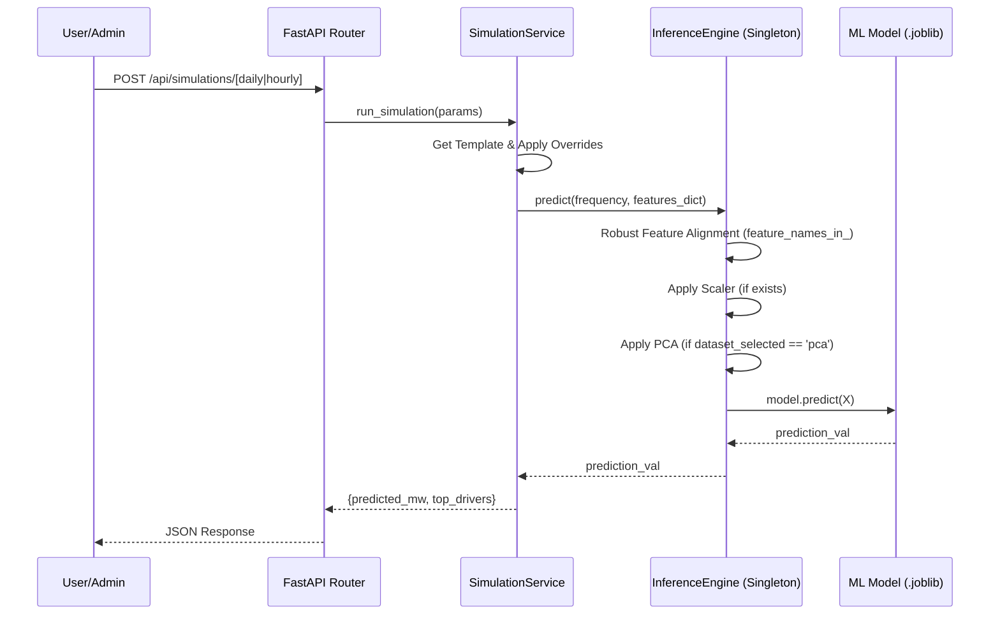

# System Design: Climate-Driven Energy Demand Analytics System

This document captures the low-level system design decisions, technical stack, database schemas, and API contracts for the project. It serves as the living technical blueprint for the development team.

## System Desing Index

### 1. Technology Stack
* #### 1.1. Backend & Machine Learning Stack
* #### 1.2. Frontend & Visualization Stack
* #### 1.3. Infrastructure & Telemetry Stack

### 2. Microservices & Containerization
* #### 2.1. Architectural Pattern
* #### 2.2. Service Breakdown & Folder Organization
* #### 2.3. Containerization Strategy (Dockerfiles)
* #### 2.4. Orchestration & API Gateway (Docker Compose & Traefik)

### 3. Data Pipeline Design
* #### 3.1. Ingestion Module
* #### 3.2. Cleaning & Temporal Alignment Module
* #### 3.3. Feature Engineering Module
* #### 3.4. Training & Evaluation

### 4. Core Backend Services Design
* #### 4.1. Authentication/Registration & Security Services
* #### 4.2. Prediction Inference Service
* #### 4.3. Administrator & Management Services
* #### 4.4. Live Data Scheduler Service
* #### 4.5. Autoregressive Prediction Engine
* #### 4.6. Backend Documentation

### 5. Databases & Data Storage Design
* #### 5.1. Relational Database - PostgreSQL
* #### 5.2. File Storage System

### 6. Frontend UI & Dashboard Design
* #### 6.1. Application State Management
* #### 6.2. View Layouts & Navigation
* #### 6.3. Data Visualization


### 7. Deployment & Operations
* #### 7.1. Database Management
* #### 7.2. Docker Environment
* #### 7.3. API Interaction Guide


## 1. Technology Stack

The technology stack used in the project is described below.

### 1.1. Backend & Machine Learning Stack

* **Backend Framework:** Python with FastAPI
* **Database Engine:** PostgreSQL; .joblib Files for ML models
* **Authentication/Security:** JWT for sessions, bcrypt for password hashing.
* **Data Manipulation & ML:** Pandas, NumPy, SciPy, Scikit-Learn, Optuna
* **Testing Framework:** pytest.

### 1.2. Frontend & Visualization Stack

* **Frontend/UI:**  Python PyQt6.
* **Dashboards:** matplotlib, plotly and seaborn with PyQt6.

### 1.3. Infrastructure & Telemetry Stack

* **Monitoring:** Docker and docker Logs


## 2. Microservices & Containerization

The system is built on a containerized microservices architecture to ensure high availability, scalability, and strict isolation between data processing, user interfaces, and the core backend.

### 2.1. Architectural Pattern

The project follows a **Layered Microservices** pattern:
1.  **Gateway Layer:** Traefik handles all incoming traffic, providing routing and security.
2.  **Application Layer:** Decoupled Frontend (PyQt6) and Backend (FastAPI).
3.  **Persistence Layer:** PostgreSQL for relational data
4.  **Batch Processing Layer:** Isolated Data Pipeline for heavy ML workloads.

### 2.2. Service Breakdown & Folder Organization

The source code is organized into a modular structure under `src/`, where each subdirectory represents a distinct service or shared resource:
*   `src/api/`: Core Backend (FastAPI). Contains the MVC logic, routers, and database models.
*   `src/app/`: Frontend Application (PyQt6).
*   `src/data_pipeline/`: Machine Learning modules (Ingestion, Cleaning, Feature Engineering, Modeling).
*   `src/databases/`: Infrastructure scripts, including database initialization SQL/Bash.

**Engineering Why:** This structure enforces clear boundaries. For example, the `data_pipeline` can be scaled or updated without affecting the availability of the `api`.

### 2.3. Containerization Strategy (Dockerfiles)

Every service includes a dedicated `Dockerfile` optimized for its specific runtime:
*   **Backend (api):** Uses `python:3.11-slim` to minimize image size. It installs `libpq-dev` and `gcc` for database connectivity. The startup command `uvicorn src.api.main:app` uses absolute imports to ensure module discovery within the container's `/app` workspace.
*   **Frontend (app):** Requires X11 libraries (`libgl1`, `libxcb-*`) to support the GUI environment. It uses `ENV DISPLAY=:0` to facilitate X11 forwarding from the host.
*   **Pipeline:** Optimized for batch execution. It sets `PYTHONPATH=/app/src` and uses a shell script (`run_pipeline.sh`) to sequence the ML stages.

### 2.4. Orchestration & API Gateway (Docker Compose & Traefik)

The entire ecosystem is orchestrated via `docker-compose.yml`, which implements **QA6 (Request Rate Limiting)** through **Traefik**.

#### 2.4.1. Traefik Gateway
Traefik acts as the single point of entry on port `80`. It uses Docker labels for service discovery:
*   **Routing:** Traffic to `localhost/api` is automatically routed to the `api` container on port `8000`.
*   **Rate Limiting:** A dedicated middleware (`api-ratelimit`) throttles traffic to 5 requests per second with a burst of 10.
    *   **QA6 Compliance:** Requests exceeding this threshold are instantly rejected with an HTTP 429 error, protecting the system's CPU and memory from spikes.

#### 2.4.2. Network Isolation
The architecture defines two distinct networks:
*   `api_net`: Connects the Gateway (Traefik), the Backend (API), and the Frontend (App).
*   `db_net`: Connects the Backend, Data Pipeline, and PostgreSQL database.
**Engineering Why:** This prevents the Frontend from directly accessing the Databases, ensuring all data requests are authenticated and validated through the Backend service.

### 2.5 How to Run the APP

* To run **full application**, run:
  ```bash
    docker compose up --build -d # If subsitutions
    # OR
    docker compose up -d # running app without modifications
   ```

* To run normal training data pipeline with models:
    ```bash
    docker compose --profile tools run pipeline #-d
    ```

## 3. Data Pipeline Design

Details on the specific classes and scripts executing the machine learning pipeline.

### 3.1. Ingestion Module

The primary objective of Ingestion Module is to reliably, securely, and reproducibly acquire external raw data and safely land it into the system's storage without altering its original state.

* **Target APIs Data Extraction:** ENTSO-E Transparency Platform (Energy Demand) & Copernicus Climate Data Store ERA5-Land (Meteorological Data).
* **Orchestration:** Driven by a master `data_retrieval(start_date, end_date, country_code)` function that sequentially triggers energy data fetching, weather data fetching, and finally, cloud backup.

### 3.1.1. Core Logic & Mechanisms:

  - **Input Validation & Idempotency:** The module strictly validates that `start_date` is not strictly after `end_date`. It features an idempotency check: before querying external APIs, the script checks if the target CSV already exists in the local directories (`/data/raw/weather/` and `/data/raw/energy/`).
    - **Engineering Why:** API quotas are restricted and calls are computationally/network expensive; skipping redundant fetches ensures resource efficiency and faster development cycles.

  - **Resilience & Exponential Backoff:** Both fetching mechanisms are wrapped in a robust retry loop (configured globally via `MAX_RETRIES = 3`).
    - **Engineering Why:** External APIs frequently experience transient outages or rate-limiting; exponential backoff (`2^attempt` seconds) allows the remote server to recover while preventing "thundering herd" failures from our system.

  - **ENTSO-E (Energy Data):**
    - Utilizes the `EntsoePandasClient` authenticated via an API key loaded from a `.env` file.
    - Automatically localizes timestamps to the `Europe/Madrid` timezone.
    - Applies a mathematically precise `+ 1 day` timedelta to the user-supplied `end_date`.
    - **Engineering Why:** Due to timezone offsets (UTC vs Europe/Madrid) and potential sampling overlaps at the end of the day, fetching an extra 24 hours ensures that the absolute final hours of the requested boundary are captured without truncation.

  - **Copernicus ERA5-Land (Weather Data):**
    - Uses the `cdsapi.Client()` to fetch 11 specific meteorological variables for a fixed geographical bounding box.
    - Handles temporary ZIP archives, memory-efficient unpacking, and standardized renaming.
    - **Edge Case Handling:** Explicitly catches `zipfile.BadZipFile`.
    - **Engineering Why:** The Copernicus API sometimes returns plain-text HTML error messages (e.g., "Queue full") masked as an HTTP 200 ZIP download. Catching this allows the system to log the actual server error and trigger a retry rather than crashing on a corrupted ZIP parse.

  - **Data Backup (`gdrive_sync.py`):**
    - Once local CSVs are securely written, the module triggers `backup_project_data()`.
    - Authenticates with Google Drive via OAuth 2.0 (`credentials.json` and `token.json`).
    - Scans both local raw directories and queries the target Google Drive folders (`WEATHER_DRIVE_FOLDER_ID` and `ENERGY_DRIVE_FOLDER_ID`).
    - Prevents redundant uploads by verifying if the exact file name already exists in the destination Drive folder before initiating the chunked, resumable media upload.
    - **Engineering Why:** Redundancy is critical for research reproducibility. By syncing to Google Drive, the team maintains a shared, persistent source of truth for raw data that survives local environment resets.


### 3.2. Cleaning & Temporal Alignment Module

The primary objective of the Cleaning & Temporal Alignment Module is to transform raw, heterogeneous energy and meteorological data into synchronized, clean, and aggregated datasets. Refactored into a modular `DataCleaner` class, it supports both high-performance batch processing of historical files and real-time ingestion for inference.

*   **Target:** Reads from `/data/raw/`, outputs to `/data/processed/` (Batch) or `/data/processed/real-time/` (Real-Time).
*   **Core Logic & Mechanisms:**

    - **Modular Class Design (`DataCleaner`):**
        - Decouples file I/O from transformation logic. It exposes cleaning methods that accept in-memory DataFrames.
        - **Engineering Why:** Enables the **Live Data Scheduler** to process real-time API payloads directly without intermediate disk writes, reducing latency.

    - **Energy Data Processing:**
        - **Time Alignment & Rounding:** Automatically rounds timestamps to the nearest 15-minute mark (xx:00, xx:15, xx:30, xx:45) and fills missing timestamps to ensure a continuous grid.
        - **Rule-Based Imputation:** Missing `Load_MW` values are handled based on frequency:
            - **Isolated (1 NaN per hour):** Linear interpolation.
            - **Multiple (>1 NaN per hour):** Mean of the exactly the **last 6 valid observations**.
        - **Max-Aggregation (Hourly):** Collapses 15-minute intervals into hourly grains using the **maximum** load value.
          - **Engineering Why:** Resource planning is driven by **peak load**.

    - **Daily Aggregation:**
        - Derives a daily dataset from the synchronized hourly data.
        - **Load_MW -> Load_MWh:** Calculated as the **sum** of the 24 hourly load values to represent total daily energy consumption.
        - **Climate Aggregates:** Continuous variables use the **mean** for daily exposure.

    - **Weather Data Normalization:**
        - **Unit Conversion:** Standardizes units (Kelvin to Celsius, Pa to hPa, m to mm, J/m² to W/m²).
        - **Outlier Detection (Dual-Pass):** IQR filtering combined with hard physical domain boundaries (Temperature: -40°C to 55°C, Wind: -69.4 to 69.4 m/s, Precip: 0 to 55 mm).
        - **Variable-Specific Imputation (Vectorized):**
            - *Thermal/Radiation:* Mean of 4 preceding and 2 subsequent valid observations.
            - *Solar:* Forced to zero during night hours (22h-04h).
            - *Wind (u10/v10):* Mean of the last 3 valid observations.
            - *Precipitation:* Forced to zero if surrounded by zeros; otherwise mean of 3 closest valid.

    - **Real-Time Adaptability:**
        - When processing prediction data (`train_data=False`), the system utilizes a dedicated `/real-time/` subfolder and a `prediction_data` prefix. This ensures the production training set remains unpolluted while providing a consolidated history of live inputs.

    - **Cleaned Data Dictionary:**

| Variable | Description | Unit | Aggregation (Hourly) | Aggregation (Daily) |
| :--- | :--- | :--- | :--- | :--- |
| `datetime` | Standardized timestamp (UTC) | ISO 8601 | Join Key | Date Key |
| `Load_MW` / `Load_MWh` | Electricity demand | MW / MWh | **Maximum** | **Sum** |
| `t2m` | 2m Air Temperature | °C | Mean | Mean |
| `skt` | Skin Temperature | °C | Mean | Mean |
| `ssrd` | Surface Solar Radiation Downwards | W/m² | Mean | Mean |
| `tp` | Total Precipitation | mm | Mean | Mean |
| `u10` / `v10` | 10m Wind Components | m/s | Mean | Mean |
| `sp` | Surface Pressure | hPa | Mean | Mean |
| `swvl1` | Volumetric Soil Water Layer 1 | m³/m³ | Mean | Mean |


### 3.3. Feature Engineering Module

The primary objective of the Feature Engineering Module is to transform synchronized data into a high-dimensional feature set that captures temporal patterns, climate inertia, and physics-based demand drivers. The refactored `FeatureEngineer` class dynamically adjusts its logic based on the data frequency (**Hourly** vs **Daily**).

*   **Target:** Reads from `/data/processed/complete_train_data_[hourly|daily].csv`, outputs to `/data/processed/feat-engineering/` as `features_[hourly|daily]_[full|selected|pca].csv`.
*   **Core Logic & Mechanisms:**

    - **Temporal Decomposition:**
        - **Hourly:** Extracts `hour`, `day_of_week`, `month`, `year`, and `season`.
        - **Daily:** Extracts `day_of_week`, `month`, `year`, and `season` (skips `hour` as it is uniform).
        - **Engineering Why:** Captures multi-scale seasonality essential for non-stationary energy demand.

    - **Frequency-Aware Rolling Features:**
        - **Hourly:** Uses a **24-period** window to represent a full solar/diurnal cycle.
        - **Daily:** Uses **7-period** and **30-period** windows to capture weekly inertia and broader monthly trends.
        - **Stats:** Calculates `mean`, `std`, `median`, `var`, `rms`, `deriv`, `skew`, `kurt`, and `iqr`.
        - **Engineering Why:** RMS captures the "energy" of weather signals, while the derivative identifies rapid cooling or heating events.

    - **Lagged Demand Features:**
        - **Hourly:** Extracts `L1` (momentum), `L24` (daily seasonality), and `L168` (weekly seasonality).
        - **Daily:** Extracts `L1` (yesterday), `L7` (weekly cycle), and `L28` (monthly cycle).
        - **Engineering Why:** Energy demand is highly auto-regressive. Daily models rely more on weekly patterns (`L7`) than diurnal ones.

    - **Physics-Derived Indicators:**
        - **HDD/CDD (Base 18°C):** Heating and Cooling Degree Hours/Days.
        - **Persistent Extremes:** Binary flags for Heatwaves and Coldwaves.
            - **Hourly:** Requires 72 consecutive hours of extreme temperature.
            - **Daily:** Requires 3 consecutive days of extreme temperature.
        - **Engineering Why:** Captures the "cumulative stress" on the grid, where demand remains high during prolonged extreme weather.

    - **Redundancy & Dimensionality Management:**
        - **Association-Based Filter (0.6 Threshold):** Removes highly collinear variables using Spearman, Lambda, and LogReg accuracy.
        - **Automated PCA Elbow Detection:** Uses the **Knee Point method** to select optimal components, ensuring transformers are saved per frequency (`scaler_[hourly|daily].joblib`).

    - **Persistence:**
        - Saves fitted states to `/models/feat-engineering/` with frequency-specific suffixes.
        - **Engineering Why:** Essential for the **Live Data Scheduler**, ensuring real-time daily or hourly inference uses the exact statistical parameters of the corresponding training set.


### 3.4. Training & Evaluation Module

The primary objective of the Training & Evaluation Module is to autonomously select the most robust model and dataset configuration through rigorous statistical validation. It transitions the pipeline from a "one-size-fits-all" approach to an adaptive strategy that handles both **Hourly** (short-term volatility) and **Daily** (long-term trend) demand patterns.

*   **Target:** Reads from `/data/processed/feat-engineering/`, persists winning binaries to `/models/`, and metadata to the `model` table in PostgreSQL.
*   **Logic & Mechanisms:**

    - **Advanced Temporal Validation:**
        - **The 1-Year Safety Gap:** All temporal splits implement a mandatory **1-year gap** between training and testing.
        - **Technical Rationale:** Energy demand is heavily influenced by climate inertia and long-term economic cycles. A simple cross-validation or a short gap would lead to **data leakage** through temporal proximity. A 1-year gap ensures the model is tested on a completely different annual cycle, proving its generalization across seasonal boundaries.
        - **Strategies Evaluated:**
            - *Expanding Window:** Cumulative training from start of history.
            - *Fixed Rolling:** Constant window size to capture only recent shifts in demand behavior.
            - *Nested Validation (Random Forest):* Internal optimization loops within each fold to prevent hyperparameter overfitting.

    - **Statistical Rigor in Selection:**
        - Instead of picking the model with the lowest average error, the system employs a **Shapiro-Wilk** normality test on the RMSE distribution across 20 partitions.
        - **Selection Decision Tree:**
            - If Normal: Uses **One-Way ANOVA** to verify if dataset/strategy performance differences are statistically significant.
            - If Non-Normal: Uses **Friedman** (for datasets) or **Kruskal-Wallis** (for strategies) tests.
        - **Engineering Why:** Ensures that the "winner" is not just lucky on a specific time window, but consistently superior with statistical significance (p < 0.05).

    - **Hyperparameter Optimization (Optuna):**
        - Utilizes the `optuna` library to conduct 30 trials per model.
        - **Search Space:** Focuses on `n_estimators` (20-100) and `max_depth` (5-15) for Random Forest.
        - **Technical Rationale:** A constrained depth prevents the model from memorizing specific training spikes, while the number of estimators provides enough variance reduction.

    - **Overfitting Check & Mitigation:**
        - **Train/Validation Gap Analysis:** The system logs mean metrics across all folds. A significant gap triggers a warning in the logs.
        - **Mitigation:** Nested validation during Optuna optimization forces the model to find parameters that work across multiple sub-folds within the training set before ever seeing the test data.

    - **Driver Analysis (Interpretability):**
        - **Linear Regression:** Extracts absolute coefficients to identify magnitude of impact.
        - **Random Forest:** Extracts Gini Importance.
        - **Modification:** The "Top 2 Event Drivers" are persisted to the database per model. This allows the frontend to show users *why* the demand is high.

    - **Persistence & Versioning:**
        - Implements Rule 8: Models are saved as `[LR|RF]_vx.joblib`.
        - Database entries link the file path with the exact `rmse`, `mae`, and `r2` metrics from the winning fold, enabling rollback to previous versions if performance degrades in production.

### 3.5. Real-Time Data Pipeline Design

The Real-Time Data Pipeline is a high-availability version of the main pipeline, optimized for low-latency inference while maintaining strict mathematical parity with the training environment.

*   **Orchestration:** Driven by `real_time_pipeline.py`, which coordinates the retrieval, cleaning, and multi-resolution feature engineering of live data.
*   **Target:** Reads from live APIs, outputs to `/data/processed/feat-engineering/real-time/`.

#### 3.5.1. Real-Time Ingestion Strategy (35-Day Window)
To satisfy the requirements of high-dimensional feature engineering, the real-time ingestion fetch window is set to **35 days** (configurable via `REAL_TIME_DAYS`).
*   **Engineering Why:**
    *   **Rolling Windows:** The `rolling_30` feature requires 30 days of prior history to calculate a valid mean/std for the current day.
    *   **Lagged Features:** The `L28_Load` feature requires data from exactly 28 days ago.
    *   **PCA Stability:** Without a 35-day buffer, these features would be filled with zeros (`NaN` fill), causing the PCA projection to "tilt" and produce values inconsistent with the training set, leading to inaccurate predictions.

#### 3.5.2. Technical Mechanisms:
*   **Resolution Alignment:** ENTSO-E queries use the `Europe/Madrid` timezone and normalized day boundaries. This ensures the API returns standard hourly data for Spain, matching the training data resolution without requiring manual resampling.
*   **Multi-Dataset Generation:** For every frequency (Hourly/Daily), the real-time pipeline generates three distinct files:
    1.  `realtime_[freq]_full.csv`: All engineered features.
    2.  `realtime_[freq]_selected.csv`: Features filtered by the 0.6 association threshold.
    3.  `realtime_[freq]_pca.csv`: Data projected into the pre-fitted PCA space.
*   **Robust File Persistence (Windows-Safe):**
    *   Implements an **Atomic Write** pattern using `.tmp` files.
    *   Explicitly handles Windows file-locking issues by catching `PermissionError` and logging descriptive diagnostics.
    *   Uses `os.replace` with string-path conversion to ensure cross-platform compatibility and prevent file corruption during high-frequency updates.
*   **Security:** Cloud synchronization (`gdrive_sync.py`) is explicitly disabled for real-time retrieval to protect API throughput and prevent uncleaned live data from polluting the research backup.


## 4. Core Backend Services Design

The backend is developed using **Python with FastAPI**, following a strict **Model-View-Controller (MVC)** architectural pattern to ensure modularity, testability, and scalability. Below it's the API structure:

```
src/
├── api/
│   ├── main.py              # Entrance Point File
│   │
│   ├── routers/             # Controller/Router Layer
│   │   │
│   │   └── endpoints/       # Sub-routes endpoints
│   │
│   ├── services/            # Business Logic 
│   │
│   ├── models/              # Data Models (PostgreSQL BD)
│   │
│   ├── schemas/             # DTOs (Data Transfer Objects)
│   │
│   ├── core/                # Global Configs
│   │
└   └── database/            # DB connection

```

*   **Model Layer:** Utilizes **SQLAlchemy** for database ORM mapping (Relational Model) and **Pydantic** for data validation and serialization (DTOs).
*   **View Layer (Routers):** Located in `src/api/routers/`, these modules define the RESTful endpoints, handle HTTP status codes, and manage request/response documentation via OpenAPI.
*   **Controller Layer (Services):** Located in `src/api/services/`, this layer contains the core business logic, isolating it from the web framework and the database details.

**Engineering Why:** Using MVC allows us to swap the database or the web framework with minimal impact on the business logic. It also enables mocking dependencies for high-coverage unit testing.

### 4.1. Authentication/Registration & Security Services

The security layer provides robust protection for user data and system access, fulfilling strict Quality Attributes (QA10-QA14).

#### 4.1.1. Security Mechanisms
- **JWT Lifecycle:** Authentication tokens are issued as signed JWTs (HS256) with a configurable expiration period.
- **Bcrypt Salting:** All user passwords are hashed using `bcrypt` with unique salts before storage.
- **Role-Based Access Control (RBAC):** Access to endpoints is restricted based on the `sub` (email) and verified against the database roles (`admin`, `client`).
- **Brute Force Protection (QA13):** Accounts are automatically locked for 5 minutes after the 4th consecutive failed login attempt.
- **Generic Failure Messages (QA10):** All authentication failures return generic "Invalid credentials" or "Account locked" messages to prevent username enumeration and leakage of system internals.

#### 4.1.2. Exception Handling Strategy
FastAPI global exception handlers standardize responses:
- **400 Bad Request:** For Pydantic schema validation failures.
- **401 Unauthorized:** For invalid credentials or expired tokens.
- **403 Forbidden:** For account lockouts or insufficient RBAC privileges.
- **404 Not Found:** For non-existent resource requests.
- **500 Internal Server Error:** For unhandled exceptions, ensuring no stack traces are leaked to the client.

### 4.1.3 API Contracts for Authentication/Registration

* **Registration:** `POST /api/auth/register`
    * **Request Type:** `application/json`
    * **Payload:**
        ```json
        {
          "username": "johndoe",
          "email": "john.doe@example.com",
          "password": "securePassword123"
        }
        ```
    * **Response:** `201 Created` with 
        ```json
        {
          "status": 201,
          "message": "User registered successfully",
          "user_id": 123,
          "timestamp": "2023-10-27T10:00:00Z"
        }
        ```

* **Authentication:** `POST /api/auth/login`
    * **Request Type:** `application/x-www-form-urlencoded` (OAuth2 Compatible)
    * **Payload:**
        ```
        username=john.doe@example.com&password=securePassword123
        ```
    * **Response:** `200 OK` with 
        ```json
        {
          "access_token": "eyJhbGciOiJIUzI...",
          "token_type": "bearer",
          "role": "user",
          "status": 200,
          "message": "Login successful",
          "timestamp": "2023-10-27T10:05:00Z"
        }
        ```

* **Logout:** `POST /api/auth/logout`
    * **Headers:** `Authorization: Bearer <token>`
    * **Response:** `200 OK` with
        ```json
        {
          "status": 200,
          "message": "Successfully logged out",
          "user_id": 123,
          "timestamp": "2023-10-27T10:30:00Z"
        }
        ```

### 4.2. Prediction Inference Service

The Prediction Inference Service manages the execution of trained ML models. It dynamically loads the production-ready model binaries and performs inference using real-time features or user-defined simulation templates.

#### 4.2.1. Inference Workflow (Sequence Diagram)
The following diagram illustrates the interaction between the User, the API, the Simulation Service, and the Singleton Inference Engine.



#### 4.2.2. Singleton Inference Engine
The `InferenceEngine` is implemented as a Singleton to prevent redundant loading of heavy model binaries (Random Forest) into memory. It maintains a cache of:
- **Models:** Frequency-specific binaries (`.joblib`).
- **Scalers:** Fitted `StandardScaler` objects for each frequency, loaded from `/models/feat-engineering/` or the model's directory.
- **PCA:** Fitted `PCA` objects, loaded only if the active model uses the 'pca' dataset strategy.

#### 4.2.3. Robust Feature Alignment
To prevent mismatch errors (e.g., 117 features sent to a 41-feature model), the Engine uses the model's or scaler's `feature_names_in_` attribute to automatically filter and order input dictionaries. This ensures that:
1.  Templates with extra features are safely pruned to the expected subset.
2.  The column order always matches the exact state during training.
3.  Missing features are identified and logged before inference.

#### 4.2.4. Scenario Simulation Engine
The simulation engine allows users to perform "What-if" analysis using 16 pre-defined templates:
- **Templates:** (Average Weather, Rainy, Storm, Heatwave) x (Daily, Hourly).
- **Overrides:** Restricted set of variables (`t2m`, `sp`, `tp`, `u10`, `v10`) can be manually tuned.
- **Validation:** Overrides are strictly validated against `PHYSICAL_LIMITS` (e.g., temperature between -40°C and 55°C).

#### 4.2.5 API Contracts for Simulations

*   **Get Available Template: `POST /api/simulations/templates`**
    *   **Description:** Returns the default feature vector for a condition, aligned with the currently active model's requirements.
    *   **Request Type:** `application/json`
    *   **Payload:** `{ "frequency": "daily", "template_name": "heatwave" }`
    *   **Response:** `{ "frequency": "daily", "template_name": "heatwave", "dataset_type": "selected", "features": {...} }`

*   **Run Daily Simulation: `POST /api/simulations/daily`**
    *   **Description:** Executes a daily prediction using a template with optional overrides.
    *   **Request Type:** `application/json`
    *   **Payload:**
        ```json
        {
          "template_name": "heatwave",
          "year": 2024,
          "month": 5,
          "day_of_week": 0,
          "overrides": { "t2m": 42.5 }
        }
        ```
    *   **Response:** `{ "predicted_mw": 32500.5, "top_drivers": ["t2m", "day_of_week"] }`

*   **Run Hourly Simulation: `POST /api/simulations/hourly`**
    *   **Description:** Executes an hourly prediction using a template with optional overrides.
    *   **Request Type:** `application/json`
    *   **Payload:**
        ```json
        {
          "template_name": "heatwave",
          "year": 2024,
          "month": 5,
          "day_of_week": 0,
          "hour": 14,
          "overrides": { "t2m": 42.5 }
        }
        ```
    *   **Response:** `{ "predicted_mw": 32500.5, "top_drivers": ["t2m", "day_of_week"] }`

### 4.3. Administrator & Management Services

These services allow authorized administrators to manage the system's operational state and promote models to production.

#### 4.3.1. Model Activation Mutex
When an administrator activates a model, the system enforces a mutex logic:
- All other models of the same `model_pred_type` (e.g., 'daily') are automatically deactivated to prevent ambiguity.
- The `InferenceEngine` is immediately notified to hot-reload the new model into memory, ensuring zero-downtime updates.

#### 4.3.2 API Contracts for Model Management

*   **List all models: `GET /api/models/`**
    *   **Description:** Returns a list of all models registered in the system with their performance metrics.
    *   **Response:** List of objects containing `model_name_id`, `model_type`, `rmse`, `r2`, `mae`, `is_active`, etc.

*   **Activate model: `PATCH /api/models/{model_id}/activate`**
    *   **Description:** Promotes a model to production. (Admin Only)
    *   **Payload:** `{ "is_active": true }`
    *   **Response:** The updated model metadata.

### 4.4. Live Data Scheduler Service

The Live Data Scheduler Service ensures that the system provides predictions based on the most recent data available. It operates as a continuous background process, decoupled from the main API requests.

*   **Continuous Scheduler (`real_time_pipeline.py`):**
    *   **Logic:** Implements a loop that wakes up at `XX:01` and `XX:31` every hour.
    *   **Cycle:** Executes the sequence: **Fetch Real-Time Ingestion (31 days)** -> **Clean & Align** -> **Feature Engineering (Hourly & Daily)**.
    *   **Engineering Why:** This frequency minimizes the delay between real-world updates (which occur hourly) and the availability of prediction inputs. Running at `:01` and `:31` ensures we catch data as soon as remote APIs update their hourly samples.

*   **API Lifespan Integration:**
    *   During the FastAPI startup sequence (`lifespan`), the API executes a synchronous run of the pipeline.
    *   **Engineering Why:** This ensures that the application never starts in a "stale" state. It guarantees that the `/data/processed/feat-engineering/real-time/` files are present and updated before the first prediction request is ever accepted.

### 4.5. Autoregressive Prediction Engine

The Prediction Engine implements a recursive forecasting strategy to provide multi-step predictions (e.g., 24 hours or 14 days into the future).

*   **Historical Context Injection:**
    *   For every request, the engine retrieves the last `historical_points` rows from the engineered real-time dataset.
    *   These points are returned to the user as `historical_load`, providing immediate visual context for the trend.

*   **The Autoregressive Loop (Feedforward):**
    1.  **Start:** The engine takes the features of the current known state ($T$).
    2.  **Predict:** The model predicts the demand for $T+1$.
    3.  **Feedback:** The prediction $\hat{y}_{T+1}$ is injected back into the feature vector as the new `L1_Load` (Lag 1).
    4.  **Temporal Update:** Calendrical features (`hour`, `day_of_week`, etc.) are incremented for the next timestamp.
    5.  **Climate Persistence (Naive):** Meteorological variables are kept constant (persisted) across the forecast horizon.
    6.  **Repeat:** The process repeats for the duration of the requested `predicted_points`.

*   **Data Integrity:**
    *   **Sync Logic:** Since Open-Meteo provides data in target units (Celsius, mm, hPa), the pipeline explicitly skips the Kelvin-to-Celsius and Pa-to-hPa conversions used for historical ERA5 data.
    *   **Unit Mapping:** Precipitation from Open-Meteo (mm) is automatically converted to meters (m) to match the ERA5 training scale (1000x difference).

#### 4.5.1. Prediction API Contract

*   **Get Prediction: `GET /api/predictions/[hourly|daily]`**
    *   **Query Params:** `historical_points` (context size), `predicted_points` (horizon size).
    *   **Response:**
        ```json
        {
          "status": 200,
          "timestamps": "2026-05-12T13:00:00Z",
          "historical_load": [25000.5, 26100.2, 25800.8],
          "load_predicted": [26000.0, 26500.5, 27000.2],
          "timestamps": [
              "2026-05-12T10:00:00Z",
              "2026-05-12T11:00:00Z",
              "2026-05-12T12:00:00Z",
              "2026-05-12T13:00:00Z",
              "2026-05-12T14:00:00Z",
              "2026-05-12T15:00:00Z"
          ],
          "top2_drivers": ["t2m", "L1_Load"]
        }
        ```

### 4.6. Backend Documentation
FastAPI provides interactive Swagger documentation at:
- **Swagger UI:** `http://localhost:8000/api/docs` (or without port for local development)
- **ReDoc:** `http://localhost:8000/api/redoc`(or without port for local development)

## 5. Databases & Data Storage Design

### 5.1. Relational Database - PostgreSQL

The system utilizes PostgreSQL as its primary relational database, structured to ensure data normalization, referential integrity, and efficient queries for predictive time-series data. The schema follows a strict Entity-Relationship model.

#### Base Tables and Role-Based Access Control

The system uses an inheritance pattern to manage different user roles. The central `users` table stores credentials and common data, while `admin` and `client` act as specialized extensions. Passwords are natively managed on the server using the `pgcrypto` extension.

**Table `users`**
Stores base credentials and account security information.

| Column Name | Data Type | Constraints | Description |
| :--- | :--- | :--- | :--- |
| `id` | BigSerial | Primary Key | Auto-generated unique identifier. |
| `email` | Text | Unique, Not Null | User email address. |
| `username` | Varchar | Unique, Not Null | Chosen username. |
| `password` | Varchar | Not Null | Password hash. |
| `account_regist_date`| Timestamp | Default: CURRENT_TIMESTAMP | Account creation date and time. |
| `failed_login_att` | Integer | Default: 0 | Counter for failed login attempts. |
| `acc_locked_until` | Timestamp | Nullable | Date and time until the account is locked. |
| `last_failed_att` | Timestamp | Nullable | Date and time of the last failed login attempt. |

**Table `admin` & `client`**
Extensions of the users table that define system privileges.

| Column Name | Data Type | Constraints | Description |
| :--- | :--- | :--- | :--- |
| `users_id` | BigInt | PK, FK | Primary key that also acts as a foreign key with ON DELETE CASCADE. |

#### Models and Requests

The `model` table stores machine learning model metadata, while the `request` table serves as the transaction hub, linking a user to a specific model execution.

**Table `model`**
Stores metadata and performance metrics of the trained models.

| Column Name | Data Type | Constraints | Description |
| :--- | :--- | :--- | :--- |
| `model_name_id` | BIGSERIAL | Primary Key | Unique model identifier. |
| `model_type` | VARCHAR(512) | Not Null | Type of machine learning model. |
| `model_creation_date` | TIMESTAMP | Not Null, Default: CURRENT_TIMESTAMP | Date the model was registered or trained. |
| `model_pred_type` | VARCHAR(512) | Not Null | Frequency/Type of prediction the model makes. |
| `model_server_relative_path`| VARCHAR(512) | Not Null | Server path to the model file. |
| `dataset_selected` | VARCHAR(512) | Not Null | The specific dataset version/strategy that yielded the best performance. |
| `top2_drivers` | VARCHAR(512) | Not Null | The top 2 most influential features for the model's predictions. |
| `rmse` | DOUBLE PRECISION | Not Null | Root Mean Square Error metric of the winning fold. |
| `mae` | DOUBLE PRECISION | Not Null | Mean Absolute Error metric of the winning fold. |
| `r2` | DOUBLE PRECISION | Not Null | R-squared metric of the winning fold. |
| `is_active` | BOOLEAN | Not Null, Default: FALSE | Indicates if the model is currently active in production. |

**Table `request`**
Logs the history of prediction requests made by users.

| Column Name | Data Type | Constraints | Description |
| :--- | :--- | :--- | :--- |
| `id` | BigSerial | Primary Key | Unique request identifier. |
| `date_req` | Timestamp | Default: CURRENT_TIMESTAMP | Date and time the request was made. |
| `model_model_name_id` | BigInt | FK | Reference to the utilized model. |
| `users_id` | BigInt | FK | User who made the request. |
| `request_type` | VARCHAR(512) | NOT NULL | Specifies the request type (e.g., 'normal' or 'advanced'). |

#### 5.1.1. Prediction Results

Predictive results are strictly separated by their temporal granularity into `predictions_daily` and `predictions_hourly`. This prevents null fields in the database and allows highly optimized queries based on the requested time horizon, using composite primary keys to ensure a 1:N relationship with the origin request. This is not used at this phase of the project.

**Table `predictions_daily`**
Stores predictions with daily granularity.

| Column Name | Data Type | Constraints | Description |
| :--- | :--- | :--- | :--- |
| `request_id` | BigInt | PK, FK | The origin request. |
| `date_day` | Date | PK, Not Null | The target day of the prediction. |
| `value_pred` | Double Precision | Not Null | The predicted electricity load value. |
| `historical_load`| JSONB | Nullable | Dynamic length historical load series used for inference. |
| `prediction_load`| JSONB | Nullable | Dynamic length predicted load series generated by the model. |

**Table `predictions_hourly`**
Stores predictions with hourly granularity.

| Column Name | Data Type | Constraints | Description |
| :--- | :--- | :--- | :--- |
| `request_id` | BigInt | PK, FK | The origin request. |
| `date_hour` | Timestamp | PK, Not Null | The target hour of the prediction. |
| `value_pred` | Double Precision | Not Null | The predicted electricity load value. |
| `historical_load`| JSONB | Nullable | Dynamic length historical load series used for inference. |
| `prediction_load`| JSONB | Nullable | Dynamic length predicted load series generated by the model. |

### 5.2 Architectural Rationale and Key Decisions

#### 5.2.1 Partial Unique Index for Model Management
To ensure system stability, the database enforces that only one model of each `model_type` can be active at any given time. This is implemented via a **Partial Unique Index**. This approach allows an unlimited number of historical models to exist while guaranteeing that the inference service never encounters ambiguity when selecting the "Live" model for a specific algorithm or frequency.

#### 5.2.2 JSONB for Variable Length Series
Predictions often involve dynamic window lengths (e.g., 7-day history vs 24-hour history). Using PostgreSQL's `JSONB` type for `historical_load` and `prediction_load` allows the system to store these arbitrary-length vectors natively within the prediction record. This prevents complex joins with secondary time-series tables and ensures that the exact input/output "snapshot" used during a specific request is perfectly preserved for audit and visualization.

#### 5.2.3 Role-Based Access Control via Table Inheritance
Instead of relying on a single, monolithic `users` table with sparse, nullable columns to accommodate different roles, the database employs a strict "Table-per-Type" inheritance pattern. The `users` table acts as the base entity containing universally required attributes (e.g., authentication credentials, login attempts). Role-specific tables (`admin` and `client`) reference this base table using their primary key as a foreign key. This guarantees zero null-column bloat and makes the system highly extensible if new roles are needed in the future. Furthermore, the aggressive implementation of `ON DELETE CASCADE` across these constraints offloads lifecycle management to the database engine. If a core user account is purged, all associated roles, prediction requests, and generated time-series data are instantaneously and safely destroyed, eliminating the risk of orphaned records.

### 5.2.4 Temporal Segregation of Predictive Data
Machine learning models inherently produce varying resolutions of time-series data. Storing these disparate granularities in a single `predictions` table would necessitate compromised data types (e.g., forcing daily dates into timestamp columns, or leaving columns null) and complex query filtering. By physically segregating `predictions_daily` (using the strict `DATE` type) and `predictions_hourly` (using `TIMESTAMP`), the schema enforces strict data consistency at the column level. The use of composite primary keys (`request_id` coupled with either `date_day` or `date_hour`) elegantly satisfies the 1:N relationship requirement. This allows a single transaction in the `request` table to fan out into hundreds of highly indexed, resolution-specific prediction rows, optimizing the database for fast retrieval by front-end dashboards.

### 5.2.5 Server-Side Cryptography for Database Seeding
Standard practices often expose plaintext passwords during initial database migrations, setup scripts, or CI/CD pipelines. To mitigate this security vulnerability, the architecture leverages PostgreSQL's native `pgcrypto` extension. By shifting the cryptographic workload to the database engine itself, passwords can be hashed and salted dynamically during the `INSERT` operation. This ensures that raw credentials are never stored in SQL dump files, migration logs, or application source code, adhering to strict zero-trust security principles from the moment the database is initialized.

### 5.3. File Storage System

The system implements a structured, hierarchical file storage strategy to manage large datasets and binary artifacts. It follows the "Medallion Architecture" principles (Raw -> Processed -> Feature Engineered) to ensure data lineage and reproducibility.

#### 5.3.1. Data Directory Hierarchy
All data is stored relative to the application root in the `data/` directory.

- **`/data/raw/` (Immutable Layer):**
    - `energy/`: Contains original ENTSO-E CSV files named by date range.
    - `weather/`: Contains original Copernicus ERA5-Land CSV/NetCDF files.
    - **Rule:** Files in this directory are strictly **read-only**. No cleaning or transformation is performed in-place.
- **`/data/processed/` (Silver Layer):**
    - Stores synchronized and aggregated datasets (`complete_train_data_hourly.csv`, `complete_train_data_daily.csv`).
    - `feat-engineering/`: Stores high-dimensional feature sets (`features_daily_selected.csv`, etc.).
- **`/data/real-time/` (Ephemeral Layer):**
    - Stores transient payloads from the Live Data Scheduler used for immediate inference.

#### 5.3.2. Model & Transformer Binaries (`/models/`)
Machine learning artifacts are persisted using the `joblib` format for efficient serialization of large NumPy arrays (Random Forest).

- **Model Naming Convention:** `[ModelType]_v[Version].joblib` (e.g., `RF_v1.joblib`).
- **Transformer Naming Convention:** `[Type]_[Frequency].joblib` (e.g., `scaler_daily.joblib`).
- **Storage Sub-directories:**
    - `models/daily/`: Linear Regression and Random Forest binaries for daily resolution.
    - `models/hourly/`: Binaries for hourly resolution.
    - `models/feat-engineering/`: Central repository for `scaler` and `pca` objects.

#### 5.3.3. Persistence & Path Resolution
- **Format:** All tabular data must be stored as **CSV** with UTF-8 encoding. All ML artifacts must be stored as **Joblib** (preferred over Pickle for security and performance).
- **Resolution:** The system uses `pathlib.Path` for all internal resolutions. Relative paths stored in the database (e.g., `models/daily/LR_v1.joblib`) are resolved against the `APP_ROOT` at runtime by the `InferenceEngine`.
- **Integrity:** Every model binary must have a corresponding entry in the `model` table, ensuring that the file system and the relational metadata remain synchronized.


## 6. Frontend UI & Dashboard Design

This section serves as a developer how-to guide for navigating and extending the frontend UI architecture, including folder structures, state management, and data visualization.

### 6.1. How to Navigate the Frontend Folder Structure

The frontend application follows a strict modular structure located in `Code/energy_prediction_system/src/app/`. As a developer, adhere to this paradigm when adding new features:

- **`client/`**: Contains services for API communication (`api_client.py`, `auth_service.py`, `prediction_service.py`). Place all HTTP request logic and endpoint integrations here.
- **`manager/`**: Handles application-wide state and session management (`session_manager.py`). Use this layer for storing secure credentials or global configurations.
- **`ui/`**: Houses all user interface elements.
  - **`views/`**: Complete screen layouts (e.g., `login_view.py`, `daily_prediction_view.py`). Each view should act as a page in the `QStackedWidget`.
  - **`components/`**: Reusable PyQt6 widgets (e.g., `plot_widget.py`, `driver_card.py`, `sidebar.py`). Keep these decoupled from specific views to maximize reusability.
  - **`resources/`**: Static assets like icons and images.
  - **`main_window.py`**: The root container that orchestrates view switching.
- **`utils/`**: Shared utility functions such as input validators (`validators.py`).

### 6.2. How to Manage Application State & Navigation

**State Management & Non-Blocking UI:**
To prevent the desktop GUI from freezing during requests, the system adopts an *Asynchronous Threading Model*:
- *QThread and Signals:* When making HTTP requests via FastAPI or processing DataFrames, offload the workload to background `QThread` instances. Ensure you connect signals to update the UI once the thread completes.
- *View Switching:* The application utilizes a `QStackedWidget` inside the `MainWindow` (`ui/main_window.py`) for managing views and navigation without spawning multiple OS windows. To add a new view, instantiate it and add it to the `QStackedWidget`, then use `.setCurrentWidget()` to navigate.

**Secure Credential Management:**
To fulfill strict quality attributes regarding client-side credential management, the frontend eliminates risks associated with plain-text variables or local `.env` storage for authenticated session tokens.
- *How to Store Tokens:* Utilize the `SessionManager` class implemented via the Python *keyring* subsystem. This approach interfaces directly with the host Operating System's native secure credential vaults.
- When a user successfully authenticates, their JWT `access_token` and role are securely committed to the vault, meaning session data remains strictly encrypted at rest and invisible to other processes or application memory dumps.

### 6.3. How to Integrate Data Visualization (Chart Components)

**Data Visualization Pipeline:**
The application uses Matplotlib integrated with PyQt6 to render dynamic charts. Here is how to implement or modify chart components:

1. **Backend Payload:** The FastAPI backend returns predictive and historical load data as JSON arrays (e.g., `historical_load`, `prediction_load`, and corresponding `timestamps`).
2. **Component Integration:** Use the `plot_widget.py` component located in `ui/components/` to render charts. This component acts as a wrapper around Matplotlib's `FigureCanvasQTAgg`.
3. **Passing Data to the Chart:**
   - In your specific view (e.g., `daily_prediction_view.py`), parse the JSON response from the API.
   - Extract the timestamp strings and pass them along with the load values to the plot widget.
   - Pass the cleaned data arrays to the plot widget's update method (e.g., calling an update function with `x_data` and `y_data`).
4. **Styling and Updates:** Ensure the plot component clears its previous state (e.g., `ax.clear()`) before drawing new lines to prevent memory leaks and visual overlapping. Apply consistent project styling (colors, legends, grid lines) within the plot widget.

## 7. Deployment & Operations

### 7.1. Database Management

The PostgreSQL database is managed via Docker Compose. It is configured to run on port `5433` to avoid conflicts with local PostgreSQL instances.

**Initialization:**
  The database automatically initializes using scripts in `Code/energy_prediction_system/src/databases/init-scripts/` (for the first time):
  - `01-create-tables.sql`: Defines the schema.
  - `02-insert-data.sql`: Seeds the database with initial admin and client users.

### 7.2. Docker Environment

The system uses Docker for containerizing the database and other such as backend.

- **Prerequisites:** Docker Desktop must be installed and running.
- **Service Isolation:** Currently, the database is isolated in its own compose file to allow for flexible development (running the backend locally or in a container).

### 7.3. API Interaction Guide

Once the backend is running (`python Code/energy_prediction_system/src/api/main.py`), you can interact with the API.

#### Authentication Flow
1. **Register:** `POST /api/auth/register` with username, email, and password.
2. **Login:** `POST /api/auth/login` with email and password. This returns an `access_token`.
3. **Authorized Requests:** Include the token in the header: `Authorization: Bearer <your_token>`.

#### Key Endpoints
- **User Info:** `GET /api/auth/me` (Requires Token)
- **Admin Check:** `GET /api/auth/admin-only` (Requires Admin Role)
- **Predictions:** `GET /api/predictions/daily` and `GET /api/predictions/hourly`.
